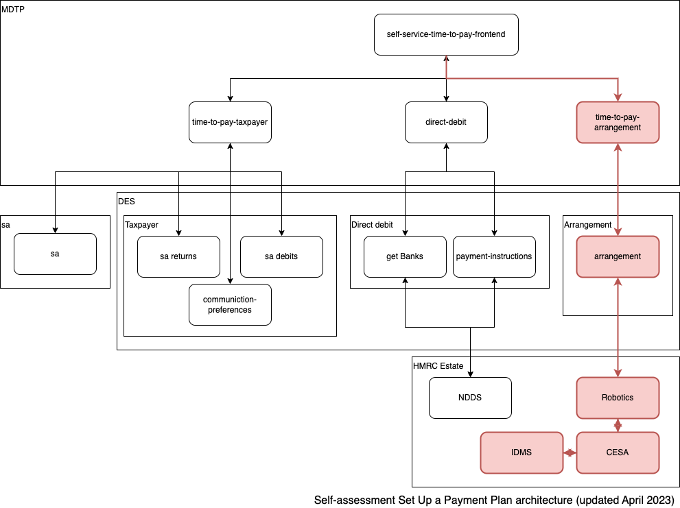

# time-to-pay-arrangement

[](https://travis-ci.org/hmrc/time-to-pay-arrangement) [  ](https://bintray.com/hmrc/releases/time-to-pay-arrangement/_latestVersion)

### About
The Arrangement service is used in the Self-service Setup a Time To Pay payment plan (SSSTTP) project for Pay What You Owe In Instalments for self-assessment tax liabilities.

It takes a POST request and builds a DES submission request using the provided data.

Before sending to DES the arrangement is saved to a local mongo database and provides a GET request in the response header that can be used to retrieve the data.

A re-try mechanism is implemented so that if DES responds with a server error, the arrangement will be resent repeatedly for up to 48 hours until it is accepted.

Below is a diagram showing where the arrangement service fits into the SSTTP project.

<a href="https://github.com/hmrc/time-to-pay-arrangement">
     <p align="center">
       
     </p>
 </a>

This is a diagram of the re-try mechanism

<a href="https://github.com/hmrc/time-to-pay-arrangement">
     <p align="center">
       
     </p>
 </a>

#### Service Definitions
The default port for this service is 8889 

#### POST /ttparrangements 

Sets up a new time to pay arrangement based on the arrangement submitted. 

Input
```
{
  "paymentPlanReference": "1234567890",
  "directDebitReference": "1234567890",
  "taxpayer": {
   "customerName": "Customer name",
   "addresses": [
           {
             "addressLine1": "addressLine1",
             "addressLine2": "addressLine2",
             "addressLine3": "addressLine3",
             "addressLine4": "addressLine4",
             "addressLine5": "UK",
             "postcode": "AB1 2DC"
           }
         ],
    "selfAssessment": {
      "utr": "1234567890",
      "communicationPreferences": {
        "welshLanguageIndicator": false,
        "audioIndicator": false,
        "largePrintIndicator": false,
        "brailleIndicator": false
      },
      "debits": [
        {
          "originCode": "IN2",
          "dueDate": "2004-07-31"
        }
      ]
    }
  },
   "bankDetails": {
    "sortCode": "12-34-56",
    "accountNumber": "12345678",
    "accountName": "Mr John Campbell"
  },
  "schedule": {
    "startDate": "2016-09-01",
    "endDate": "2017-08-01",
    "initialPayment": 50,
    "amountToPay": 5000,
    "instalmentBalance": 4950,
    "totalInterestCharged": 45.83,
    "totalPayable": 5045.83,
    "instalments": [
      {
        "paymentDate": "2016-10-01",
        "amount": 1248.95
      },
      {
        "paymentDate": "2016-11-01",
        "amount": 1248.95
      },
      {
        "paymentDate": "2016-12-01",
        "amount": 1248.95
      },
      {
        "paymentDate": "2017-01-01",
        "amount": 1248.95
      }
    ]
  }
}
```

| Status Code | Description |
|---|---|
| 201 | TTP Arrangement created with header location  |
| 401 | Not authorised to submit the TTP arrangement  |

Sending the new arrangement to the core api via DES is now executed in a resilient manner. Failures will be retried periodically.
The retry mechanism has the following configuration parameters in application.conf

| Configuration Parameter | Description |
|---|---|
| queue.retryAfter | the time to wait before retrying a failed submission to DES  |
| queue.available.for | the time the request remains available to be retried after the initial failure |
| queue.ttl | the time the request remains in the queue  |
| poller.initialDelay | the time the retry mechanism should wait at startup before it begins checking for failed submissions |
| poller.interval | the interval between checks for failed submissions to DES |

#### GET /ttparrangements/{arrangement-identifier}

Returns a specific arrangement based on the identifier. This api is for internal use only and the data lives for 30 days

```    
{
  "id": "XXXXXXXX-XXXX-XXXX-XXXX-XXXXXXXXXXXX",
  "createdOn": "2017-03-23T11:11:38.964",
  "paymentPlanReference": "1234567890",
  "directDebitReference": "1234567890",
  "taxpayer": {
    "customerName": "Customer name",
    "addresses": [
      {
        "addressLine1": "addressLine1",
        "addressLine2": "addressLine2",
        "addressLine3": "addressLine3",
        "addressLine4": "addressLine4",
        "addressLine5": "UK",
        "postcode": "AB1 2DC"
      }
    ],
    "selfAssessment": {
      "utr": "1234567890",
      "communicationPreferences": {
        "welshLanguageIndicator": false,
        "audioIndicator": false,
        "largePrintIndicator": false,
        "brailleIndicator": false
      },
      "debits": [
        {
          "originCode": "IN2",
          "dueDate": "2004-07-31"
        }
      ]
    }
  },
  "schedule": {
    "startDate": "2016-09-01",
    "endDate": "2017-08-01",
    "initialPayment": 50,
    "amountToPay": 5000,
    "instalmentBalance": 4950,
    "totalInterestCharged": 45.83,
    "totalPayable": 5045.83,
    "instalments": [
      {
        "paymentDate": "2016-10-01",
        "amount": 1248.95
      },
      {
        "paymentDate": "2016-11-01",
        "amount": 1248.95
      },
      {
        "paymentDate": "2016-12-01",
        "amount": 1248.95
      },
      {
        "paymentDate": "2017-01-01",
        "amount": 1248.95
      }
    ]
  },
  "desArrangement": {
    "ttpArrangement": {
      "startDate": "2016-09-01",
      "endDate": "2017-08-01",
      "firstPaymentDate": "2016-10-01",
      "firstPaymentAmount": "1298.95",
      "regularPaymentAmount": "1248.95",
      "regularPaymentFrequency": "Monthly",
      "reviewDate": "2017-01-22",
      "initials": "ZZZ",
      "enforcementAction": "Summary Warrant",
      "directDebit": true,
      "debitDetails": [
        {
          "debitType": "IN2",
          "dueDate": "2004-07-31"
        }
      ],
      "saNote": "DDI 1234567890, PP 1234567890, First Payment Due Date 01/10/2016, First Payment £1298.95, Regular Payment £1248.95, Frequency Monthly, Final Payment £1248.95, Review Date 22/08/2017"
    },
    "letterAndControl": {
      "customerName": "Customer name",
      "salutation": "Dear  Customer name",
      "addressLine1": "addressLine1",
      "addressLine2": "addressLine2",
      "addressLine3": "addressLine3",
      "addressLine4": "addressLine4",
      "addressLine5": "UK",
      "postCode": "AB1 2DC",
      "totalAll": "5000.00",
      "clmIndicateInt": "Including interest due",
      "clmPymtString": "Initial payment of 1298.95 then 2 payments of 1248.95 and final payment of 1248.95",
      "officeName1": "HMRC",
      "officeName2": "DM 440",
      "officePostcode": "BX5 5AB",
      "officePhone": "0300 200 3822",
      "officeFax": "01708 707502",
      "officeOpeningHours": "Monday - Friday 08.00 to 20.00",
      "template": "DMTC13"
    }
  }
}
```

| Status Code | Description |
|---|---|
| 200 | Returns TTP Arrangement  |
| 404 | Could not find the resource  |

### License

This code is open source software licensed under the [Apache 2.0 License]("http://www.apache.org/licenses/LICENSE-2.0.html")

